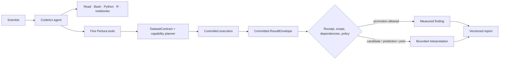
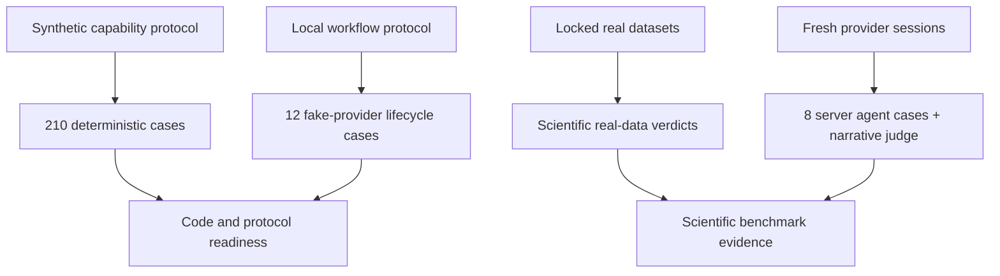

# Pertura

**A capability-first Perturb-seq analysis runtime for scientific CodeAct agents.**

Pertura lets an LLM inspect files, write code, use Bash, Python, R, and notebooks, while keeping scientific claims tied to what was actually executed. The agent stays flexible; contracts, dependencies, result provenance, and claim ceilings live outside the model.

> [!IMPORTANT]
> **Current status: `0.2.0a9` research alpha.** The local product and synthetic protocol are implemented and tested. Expanded analysis capabilities remain `synthetic_only` candidates until real-data server benchmarks are complete. Pertura is not yet a production-validated clinical or scientific decision system.

## Why Pertura?

Perturb-seq analysis is not one tool call. A useful workflow must connect dataset structure, guide assignment, screen quality, cell state, replicate-aware statistics, biological interpretation, and virtual-model evaluation—without letting an LLM turn a plausible narrative into stronger evidence than the analysis supports.

Pertura separates three concerns:

1. **CodeAct exploration** — Claude can freely inspect data and write exploratory code.
2. **Capability execution** — registered methods validate design, dependencies, scope, resources, and outputs.
3. **Claim rendering** — reports distinguish measured results, candidate analyses, predictions, priors, and hypotheses.



## One small tool surface, broad analysis coverage

Claude sees exactly five Pertura domain tools:

| Tool | Responsibility |
|---|---|
| `inspect_dataset` | Register the dataset design and create a versioned `DatasetContract` |
| `run_diagnostic` | Run intake, guide/QC, design-balance, and reliability diagnostics |
| `run_analysis` | Select or validate a capability and execute it through the runtime |
| `evaluate_virtual_model` | Evaluate predictions under frozen splits, leakage checks, and mandatory baselines |
| `finalize_report` | Render current results under runtime-derived claim ceilings |

These tools do **not** replace CodeAct. Claude retains `Read`, `Glob`, `Grep`, `Bash`, `Write`, `Edit`, and notebook access. Free-form code remains exploratory unless a registered capability validates and commits its output.

The current capability catalog covers most of the intended Perturb-seq workflow:

| Phase | Implemented scope |
|---|---|
| Data and design intake | H5AD, MuData, 10x/Cell Ranger, delimited matrices, barcode/layer/design inspection |
| Guide assignment and screen QC | guide-map integrity, reverse complement, NB-mixture assignment, ambient guide, MOI, multi-guide, cell doublets, retained cells |
| Cell-state and module reference | control-derived state reference, frozen kNN mapping, annotation candidates, GMT import, control-only NMF |
| Target reliability | detectability, direction, guide heterogeneity, bootstrap/LOO sensitivity, Mixscape responder/escape, aggregate failure queue |
| Effect estimation and calibration | edgeR pseudobulk, SCEPTRE, Propeller, guide-target sensitivity, module/global summaries, replicate-level null calibration |
| Biological interpretation | response programs, perturbation clustering, ORA/GSEA, regulator activity, literature provenance, evidence mapping |
| Virtual experiments | multi-axis split contracts, chunked prediction ingestion, leakage audit, mandatory baselines, comprehensive evaluation, next-panel design |

## Scientific authority is explicit

Pertura does not infer evidence strength from prose.

| Result class | What it means | Strong measured claim? |
|---|---|---|
| Receipt-verified measured result | Bundled execution passed method, scope, dependency, and policy checks | Only if promotion rules also pass |
| Validated-untrusted candidate | The capability validator passed, but the method is still exploratory or synthetic-only | No |
| Prediction | A model output or derived virtual evaluation | No; remains prediction |
| Curated prior | Versioned external biological knowledge | No; remains prior |
| Hypothesis | Mechanistic interpretation or next-experiment proposal | No |

Upstream contract, asset, reference, module, or result changes propagate `stale` state. Blocked, unresolved, stale, mixed-scope, legacy, and aborted-session results cannot support a strong statement.

Receipts record execution provenance inside the controlled Pertura runtime. They are designed to prevent unsupported claim promotion—not to prove that arbitrary malicious code running as the same operating-system user is cryptographically harmless.

## Current validation checkpoint

The checked-in local protocol currently records:

- **210 / 210** synthetic capability cases passed across 35 exploratory capabilities;
- **12 / 12** deterministic agent-workflow hard-gate cases passed;
- **5** stable Pertura domain tools;
- frozen v0.2 schemas, tool contracts, promotion policy, receipt payload, and scope semantics;
- Python regression, dashboard API/component tests, and a reproducible Vite production build.

Synthetic fixtures establish code and protocol readiness only. They do not make a capability trusted and do not replace the planned real-data benchmarks on Replogle, Papalexi, Norman, and Kang.

```text
code_ready                 true
local_fixture_ready        true
local_agent_protocol_ready true
real_benchmark_ready       false
real_agent_behavior_ready  false
release_ready              false
```

## Quick start

Python 3.10 or later is required.

```bash
python -m venv .venv
source .venv/bin/activate          # Windows: .venv\Scripts\activate
python -m pip install -e ".[dev,dashboard]"
```

Install the Claude adapter only when needed:

```bash
python -m pip install -e ".[llm,dashboard]"
```

Scientific packages are supplied through explicit Micromamba profiles rather than installed into the runtime environment. This is the required path for server benchmarks and avoids accidental source builds on older Linux hosts. The `omics` and `perturbseq` pip extras are intended only for compatible developer workstations, not the frozen benchmark runtime.

Create a persistent project and register a dataset without copying a large source file:

```bash
pertura project init ./my-screen
pertura assets add ./my-screen /data/screen.h5ad \
  --role primary_dataset --kind observed
pertura inspect ./my-screen
```

Inspect the available methods and run through the same product runtime from the CLI:

```bash
pertura capabilities list
pertura capabilities show diagnostic.dataset_integrity.v1
pertura diagnostic diagnostic.dataset_integrity.v1 ./my-screen
pertura analyze "replicated low-MOI expression" ./my-screen
pertura finalize current --workspace ./my-screen
pertura dashboard ./my-screen
```

Missing design fields, dependencies, or environments return blockers. Pertura does not silently substitute a weaker method.

### Claude CodeAct

The Claude adapter loads five provider-neutral Perturb-seq skills by default while retaining free CodeAct access:

```bash
pertura-claude ./my-screen \
  --new-conversation \
  --task "Inspect this Perturb-seq screen, diagnose its design, and propose the next valid analysis."
```

Additional skill plugins must be supplied explicitly. User-global and project-global skills are not loaded by default.

```bash
pertura-claude ./my-screen --skill-plugin /path/to/plugin
pertura-claude ./my-screen --no-bundled-skills
```

The OpenAI Agents SDK adapter currently provides import-safe tool-schema and instruction projection only. It does not make API requests and has no runnable CLI yet.

## Scientific environments

Scientific environments are explicit and are never installed during analysis:

```bash
pertura env setup python-science-v1
pertura env doctor python-science-v1

pertura env setup perturbseq-python-v1
pertura env doctor perturbseq-python-v1

pertura env setup edger-v1
pertura env doctor edger-v1

pertura env setup interpretation-v1
pertura env doctor interpretation-v1

pertura env setup virtual-eval-v1
pertura env doctor virtual-eval-v1
```

Analysis is offline by default. Versioned knowledge resources are maintained separately, and literature access is restricted to an explicit opt-in Europe PMC capability.

## PerturaBench

PerturaBench separates scientific capability evaluation from agent workflow evaluation.



Local maintenance commands:

```bash
python -m pertura_bench validate-cases --repo .
python -m pertura_bench skills validate --repo .
python -m pertura_bench run-matrix \
  --tier synthetic_ci --repo . --write-frozen-synthetic-verdicts
python -m pertura_bench agent run-local \
  --repo . --output .p07_runs/agent-local --write-frozen-verdicts
python -m pertura_bench export-server-plan --output server-plan.json
```

Real benchmark data is never downloaded implicitly or committed to Git. Formal server verdicts require:

```text
source manifest
→ checksum verification
→ conversion lock
→ subset lock
→ calibration/evaluation split
→ DataAsset registration
→ capability or agent benchmark
```

The planned real-data coverage is:

| Dataset | Primary benchmark role |
|---|---|
| Replogle | intake, guide/screen QC, CRISPRi target reliability |
| Papalexi | state reference, Mixscape responder/escape |
| Norman | high-MOI association, CRISPRa/combinations, virtual evaluation |
| Kang | edgeR and Propeller replicate-aware golden cases; not presented as Perturb-seq |

## Repository map

```text
src/pertura_core       frozen contracts, scope, promotion, receipt semantics
src/pertura_workflow   capability specs, planners, validators, scientific runners
src/pertura_runtime    projects, assets, turns, authority sessions, tools, adapters, UI
src/pertura_bench      benchmark schemas, cases, execution harnesses, server plans
src/pertura_gate       legacy read-only compatibility and regression surface
ui/                    React/Vite dashboard source
compatibility/v0.2/    generated public compatibility snapshot
```

Legacy registrars, stages, and classic recipes are regression-only internals. They are not part of the default CLI, MCP surface, or product import path.

## Validate a checkout

```bash
python -m pytest -q
python scripts/check_version_sync.py --repo .
python scripts/freeze_v020_contracts.py --check
python scripts/export_benchmark_schemas.py --check
python scripts/freeze_capability_parameters.py --check
python scripts/audit_capabilities.py --repo .
python -m pertura_bench validate-cases --repo .
python -m pertura_bench skills validate --repo .

cd ui
npm ci
npm test
npm run build
```

## Documentation

- [Capability-first architecture](docs/14_capability_first_product_architecture.md)
- [Current implementation status](docs/15_v020_implementation_status.md)
- [Five-tool product surface](docs/06_mcp_tool_surface.md)
- [Benchmark protocol](docs/benchmark_design.md)
- [Benchmark data boundary](benchmarks/README.md)
- [Legacy documentation map](docs/legacy/README.md)

Pertura is now feature-frozen for the first server benchmark. Until real-data verdicts and expert-adjudicated CRISPRi/CRISPRa profiles are complete, all expanded capabilities remain research candidates and `release_ready` remains false.
