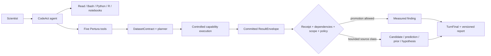
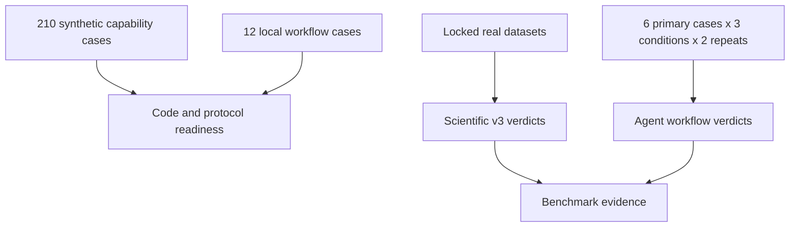

# Pertura

**A capability-first Perturb-seq analysis runtime for scientific CodeAct agents.**

Pertura lets an LLM inspect files, write Python/R, use Bash and notebooks, while keeping scientific statements tied to committed analysis results. The agent remains flexible; dataset contracts, dependency resolution, execution provenance, claim ceilings, and report rendering live outside the model.

> [!IMPORTANT]
> **Current status: `0.2.0a16` research alpha.** Local product and synthetic protocols are implemented. Expanded capabilities remain exploratory and `synthetic_only` until real-data server benchmarks are complete. Pertura is not a production-validated scientific or clinical decision system.

## Why Pertura?

A Perturb-seq workflow spans dataset intake, guide assignment, screen QC, cell-state references, replicate-aware statistics, biological interpretation, and virtual-model evaluation. LLM agents are useful because these workflows require inspection and adaptation, but unconstrained prose can overstate what an analysis supports.

Pertura separates:

1. **CodeAct exploration** — Claude can inspect data and write exploratory code.
2. **Capability execution** — registered methods validate design, parameters, dependencies, scope, resources, and outputs.
3. **Claim rendering** — runtime policy separates measured results, exploratory candidates, predictions, priors, and hypotheses.



## Five tools, free CodeAct

Claude sees exactly five Pertura domain tools:

| Tool | Responsibility |
|---|---|
| `inspect_dataset` | register assets, inspect design, and create a versioned `DatasetContract` |
| `run_diagnostic` | run intake, guide/QC, design-balance, and reliability diagnostics |
| `run_analysis` | plan or validate a capability and execute it through the runtime |
| `evaluate_virtual_model` | evaluate predictions under frozen splits, leakage checks, and baselines |
| `finalize_report` | render current results under runtime-derived claim ceilings |

These tools do not replace CodeAct. Claude retains file, shell, Python/R, editing, and notebook access. Free-form outputs remain exploratory unless a registered capability validates and commits them.

## Analysis coverage

| Area | Implemented scope |
|---|---|
| Data and design intake | H5AD, MuData, 10x/Cell Ranger, delimited matrices, barcode/layer/design inspection |
| Guide assignment and screen QC | guide-map integrity, reverse complement, NB-mixture assignment, ambient guide, MOI, multi-guide, cell doublets, retained cells |
| Cell-state and module reference | control-derived reference, frozen kNN mapping, annotation candidates, GMT import, control-only NMF |
| Target reliability | detectability, direction, guide heterogeneity, bootstrap/LOO sensitivity, Mixscape responder/escape |
| Effect estimation and calibration | edgeR pseudobulk, SCEPTRE, Propeller, guide-target sensitivity, module/global summaries, replicate-level null calibration |
| Biological interpretation | response programs, perturbation clustering, ORA/GSEA, regulator activity, literature provenance, evidence mapping |
| Virtual experiments | multi-axis splits, chunked prediction ingestion, leakage audit, mandatory baselines, evaluation, next-panel design |

The catalog phase is presentation metadata only. Scientific dependencies are determined by `depends_on`, DAG acyclicity, and an explicit policy for dependency scope, usage, and accepted status.

## Scientific authority

Pertura does not infer evidence strength from wording.

| Result class | Meaning | Strong measured claim? |
|---|---|---|
| Receipt-verified measured result | bundled trusted execution passed method, scope, dependency, session, and policy checks | only when promotion also passes |
| Validated-untrusted candidate | validator passed, but the capability is exploratory or synthetic-only | no |
| Prediction | model output or virtual evaluation | no; remains prediction |
| Curated prior | versioned external knowledge | no; remains prior |
| Hypothesis | interpretation or next-experiment proposal | no |

There is one active authority spine:

```text
ResultEnvelope -> pertura_core.promotion -> TurnFinal / report
```

Runtime-resolved dependency hashes are authoritative. Stale, blocked, unresolved, mixed-scope, legacy, aborted-session, candidate, prediction, prior, and hypothesis records cannot support a strong measured statement.

Receipts are controlled-runtime execution provenance. They are not a claim that arbitrary malicious code running as the same operating-system user is cryptographically harmless.

## Quick start

Python 3.10+ is required.

```bash
python -m venv .venv
source .venv/bin/activate             # Windows: .venv\Scripts\activate
python -m pip install -e ".[dev,dashboard]"
```

Install the Claude adapter when needed:

```bash
python -m pip install -e ".[llm,dashboard]"
```

Create a project and register a large dataset without copying it:

```bash
pertura project init ./my-screen
pertura assets add ./my-screen /data/screen.h5ad   --role primary_dataset --kind observed
pertura inspect ./my-screen
pertura assets doctor ./my-screen
```

Inspect and execute capabilities:

```bash
pertura capabilities list
pertura capabilities show diagnostic.dataset_integrity.v1
pertura diagnostic diagnostic.dataset_integrity.v1 ./my-screen
pertura analyze "replicated low-MOI expression" ./my-screen
pertura finalize current --workspace ./my-screen
pertura dashboard ./my-screen
```

Missing design facts, dependencies, asset roles, or environments return blockers. Pertura does not silently substitute another method.

### Claude adapter

Five provider-neutral Perturb-seq skills are bundled while free CodeAct remains available:

```bash
pertura-claude ./my-screen   --new-conversation   --task "Inspect this Perturb-seq screen and propose the next valid analysis."
```

Additional skill plugins are opt-in. User-global and project-global skills are not loaded by default.

```bash
pertura-claude ./my-screen --skill-plugin /path/to/plugin
pertura-claude ./my-screen --no-bundled-skills
```

The OpenAI Agents SDK adapter is currently an import-safe tool-schema/instruction projection only; it does not make API requests.

## Scientific environments

Analysis never installs packages implicitly. Use only the profiles required by a workflow:

```bash
pertura env setup python-science-v1
pertura env doctor python-science-v1

pertura env setup perturbseq-python-v1
pertura env doctor perturbseq-python-v1

pertura env setup edger-v1
pertura env doctor edger-v1
```

Additional profiles include `sceptre-v1`, `composition-v1`, `interpretation-v1`, and `virtual-eval-v1`. Server verdicts bind the corresponding environment lock hash.

## PerturaBench

PerturaBench separates scientific capability evaluation from agent workflow evaluation.



Local validation:

```bash
python -m pertura_bench validate-cases --repo .
python -m pertura_bench skills validate --repo .
python -m pertura_bench run-matrix   --tier synthetic_ci --repo . --write-frozen-synthetic-verdicts
python -m pertura_bench agent run-local   --repo . --output .p07_runs/agent-local --write-frozen-verdicts
```

Formal real-data runs require a source/conversion/subset lock chain, disjoint calibration/evaluation splits, and three external catalogs:

```text
design-confirmations.json
real-parameters.json
metric-references.json
```

The initial datasets are Replogle, Papalexi, Norman, and Kang. Kang is used only as a replicated statistical reference, not presented as Perturb-seq.

The agent comparison runs the same Claude model, data, task, context, time, scheduler/cgroup-enforced resources, and scientific reference catalog under `pertura_full`, `prompt_only`, and `free_codeact`. Every condition writes the same provider-neutral `benchmark_result.json`; formatting alone cannot pass without case-specific frozen scientific metrics. Six Perturb-seq cases, three conditions, and two repeats produce 36 primary runs. The two Kang agent cases are supplemental statistical demonstrations and do not enter the primary system comparison. Narrative judging uses fixed `deepseek-v4-pro` with no fallback.

See [benchmark design](docs/benchmark_design.md) and the [server operations guide](docs/16_server_benchmark_operations_and_extension_guide.md).

## Current checkpoint

The checked-in protocol targets:

```text
build_version:              0.2.0a16
repository_ready:           true
runtime_spine_ready:        true
dependency_policy_ready:    true
sparse_execution_ready:     true
local_fixture_ready:        true
local_agent_protocol_ready: true
real_benchmark_ready:       false
real_agent_behavior_ready:  false
release_ready:              false
```

Synthetic fixtures establish code readiness only. They do not make a capability trusted or replace real-data and expert-adjudicated evaluation.

## Repository map

```text
src/pertura_core       frozen contracts, scope, promotion, receipt semantics
src/pertura_workflow   capabilities, planner, validators, scientific runners
src/pertura_runtime    projects, assets, turns, authority sessions, tools, adapters, UI
src/pertura_bench      benchmark schemas, cases, harnesses, server plans
legacy/                excluded registrar/stage/evidence archive and its separate tests
ui/                    React/Vite dashboard source
compatibility/v0.2/    generated public compatibility snapshot
```

The legacy evidence lattice, registrars, stages, and classic recipes are excluded from wheel/sdist and the active import path. They are regression-only and cannot produce v0.2 authority.

## Validate a checkout

```bash
python -m pytest -q
python scripts/check_version_sync.py --repo .
python scripts/freeze_v020_contracts.py --check
python scripts/export_benchmark_schemas.py --check
python scripts/freeze_capability_parameters.py --check
python scripts/audit_capabilities.py --repo .
python -m pertura_bench validate-cases --repo .
python -m pertura_bench skills validate --repo .
```

Legacy regression is a separate lane:

```bash
PYTHONPATH=legacy/src:src python -m pytest -c legacy/pytest.ini legacy/tests
```

Dashboard:

```bash
cd ui
npm ci
npm test
npm run build
```